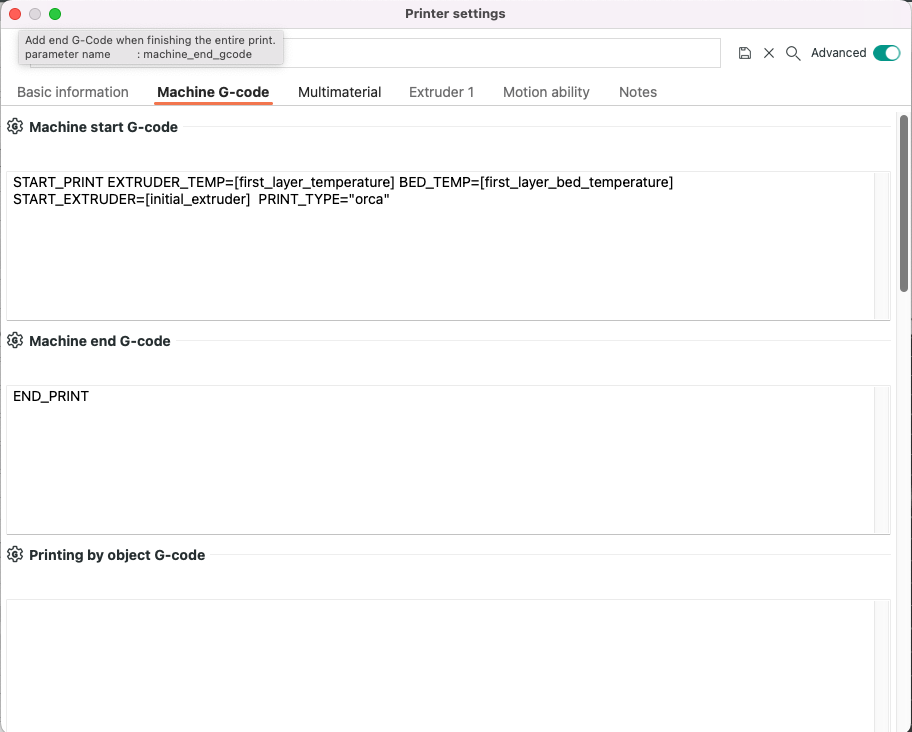
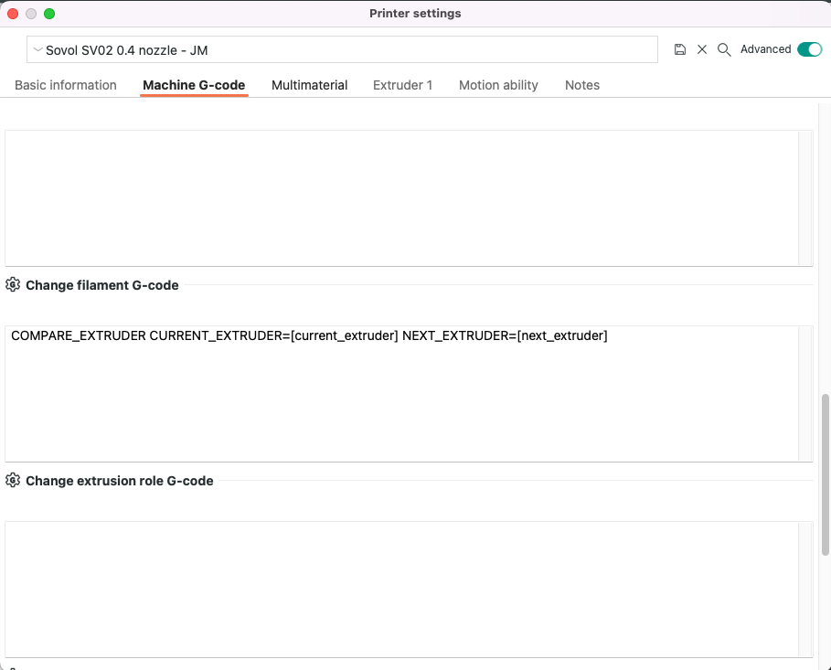

Klipper on the Sovol SV02 with Dual Extrusion (Orca and Cura)
-------------------------------------------------------------

### Introduction

This guide details setting up Klipper on the Sovol SV02 for dual extrusion, allowing you to use both Orca and Cura slicers without modifying Cura's gcode.

So in Orca I needed a way to change filiment but it's a bit different than Cura. You can set gcode for each filiment. So if you want to do it the same as Cura you would need to duplicate filaments and I am not sure that would work... it seemed like a bridge to far. 

I used the Change filament gcode sestion under printer settings to do the job. It calls a `COMPARE_EXTRUDER` macro to compare the `current_extruder` to the `next_extruder` to determine if a different extruder is being called. If so call the `END_EXTRUDER` macro. 

Then switches to the `next_extruder` (only in Orca) and uses a `purge_bucket` macro to flush the nozzle

**Note** Since this gcode is called before a filament change but not before.  No filament loading on start. Hince the Filament loading (Orca only) decision in the `START_PRINT` gcode to solve the loading problem.

All of these macros are in the printer.cfg in this repo

### Goals

-   Maintain Cura start gcode without modification.
-   Enable printing from either extruder.
-   Consolidate code for efficiency.


###  Printer Setup

-   Klipper on a Raspberry PI 3B
-   BLTouch
-   2 in 1 out Stock Hotend


### Macros Used
- [START_PRINT](#start_print)
- [START_EXTRUDER](#start_extruder)
- [END_EXTRUDER](#end_extruder)
- [COMPARE_EXTRUDER](#compare_extruder-orca)
- [PURGE_BUCKET](#purge_bucket-orca-only-for-now)

#### START_PRINT 

Macro to prepare and start a print
Both Cura and Orca use this macro. There is a `SLICER` param to define the extruder prep method.

**Orca Settings** 



**Cura Settings**


To be more specific I needed to create a way to only load the filiment if Orca was used. In Orca settings we only define a tool change macro in the tool change macro section of settings. So each print would start without the filiment loaded. This part of the macro preloads the filament accordingly for any print sliced with Orca. 


##### Slicer gcode
```
START_PRINT EXTRUDER_TEMP=[first_layer_temperature] BED_TEMP=[first_layer_bed_temperature] START_EXTRUDER=[initial_extruder]  PRINT_TYPE="orca" 
```

##### Macro

```
[gcode_macro START_PRINT]  ; Macro to prepare and start a print
gcode:
# Set default values (optional, adjust in Klipper config)





# Units and fans
G21 ; mm units
M107 ; Turn off fans

# Home and heat
G28 ; Home axes
M118 Bed: {BED_TEMP} Extruder: {EXTRUDER_TEMP}
M140 S{BED_TEMP} ; Heat bed
M109 S{EXTRUDER_TEMP} ; Heat extruder
M190 S{BED_TEMP} ; Wait for bed temp

# Bed mesh calibration (if defined elsewhere)
BED_MESH_CALIBRATE

# Select initial extruder
T{INITIAL_EXTRUDER}

# Filament loading (Orca only)

  M118 Loading filament for Orca
  M83 ; Relative extrusion mode
  G1 Z5 F240 ; Move to Z height
  G1 X10 Y20 F3000 ; Move to position
  G1 E93 F2000 ; Extrude filament (relative)
  G92 E0 ; Reset to absolute mode

  M118 You are using CURA, Nothing to do... Continue
  # No specific actions for Cura (placeholder)


# Pre-prime
G1 F3000 X5 Y10 Z0.2 ; Move to prime position
G92 E0 ; Reset extrusion

# Final prime
G1 F600 X160 E5 ; Prime nozzle
G1 F5000 X180 ; Wipe
G92 E0 ; Reset extrusion
```  

#### START_EXTRUDER
Macro For Cura to load Filament and change temp if needed. Cura uses this macro because it does not have a tool change gcode section in settings. 

As a matter of fact I think it's important to mention that the `START_EXTRUDER` gcode is always called. The End gocde is **only** called when the slicer is processing more that one filament in a print.

##### Slicer gcode
I pass in a hard value of the extruder 0 for the left extruder and 1 for the right. 
```
START_EXTRUDER EXTRUDER=0 EXTRUDER_TEMP={material_print_temperature}
```

##### Macro
```
[gcode_macro START_EXTRUDER]  ; Select and initiate extruder
gcode:
   
    

  M118 Loading Extruder T{EXTRUDER_NR}...
  G92 E0 ; Reset extruder distance
  G1 F2000 E93 ; Load filament
  G92 E0 ; Reset extruder distance again
  M104 S{EXTRUDER_TEMP} ; Set extruder temperature
  ```
#### END_EXTRUDER
Macro to move out of the way and unload Filament.

##### Slicer gcode
```
[gcode_macro END_EXTRUDER]
gcode:
  M118 Changing Filament...
  G92 E0 ;reset extruder distance
  G1 F1500 E-5 ;short retract
  G1 F2400 X250 Y220
  G1 F3000 E-93  ;long retract for filament removal
  G92 E0 ;reset extruder distance
  G90
  ```

### COMPARE_EXTRUDER (Orca)
So in Orca I needed a way to change filiment but it's a bit different than Cura.

**Orca Settings**



##### Slicer gcode
```
COMPARE_EXTRUDER CURRENT_EXTRUDER=[current_extruder] NEXT_EXTRUDER=[next_extruder]
```

##### Macro
```
[gcode_macro COMPARE_EXTRUDER]
gcode:
    # Get passed Current extruder or use current
    # Get passed Next extruder or use current
  
    M118 Switching Extruders to T{next}
    END_EXTRUDER
    T{next}
    PURGE_BUCKET
  
     M118 Extruders are the same, skipping filament change... 
     T{current}
  
  ```


### PURGE_BUCKET (Orca only, for now)

I didnt not write this, but I can not remember where I got it. If someone knows who wrote this I will give attrubution. Its a replacement for the prime tower and seems to work well. So far I only call it in the compare extruder macro

##### Macro

```
[gcode_macro PURGE_BUCKET]
gcode:
 #Absolute Coordinates
 G90
 #Move to Scrape Area
 G0 X310 F3000
 #Use Relative Extrusion
 M83
 #Extrude amount for scrape
 G1 E93 F2000
 G1 E25 F100
 G1 E5 F85
 #Quick Retract to stop filament ooze
 G1 E-7 F1500
 #wait 3 seconds to allow for ooze
 G4 P3000
 #Scrape Material
 G0 X140 F8000
 #Realtive Coordinates
 G91
 #Lower Z
   # G1 Z-5 F480 # remove me
 #Wait for current moves to finish
 M400 
 #Extrude Amount Ready for Print
 G1 E6 F450
 #Reset Extruder
 G92 E0
 #Use Absolute Coordinates
 G90

```
